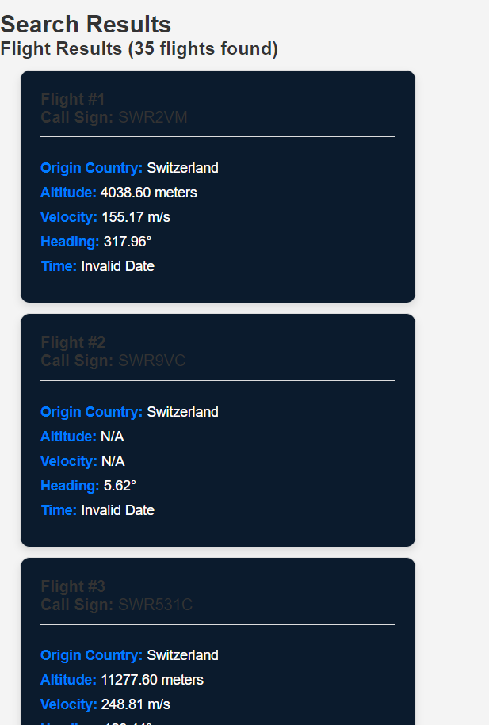

# ✈️ TravelSphere App

TravelSphere is a web-based application that provides users with real-time flight data. It allows users to search for flights and view key details such as flight origin, altitude, velocity, and heading. Built using HTML, CSS, and JavaScript, the app leverages external APIs for dynamic data retrieval and is deployed for seamless access.

---

## 🚀 Features

- **🌍 Search for Flights**
  - Input origin and destination to retrieve flight information.
  - Filters results to display only relevant data.

- **📊 Flight Information**
  - Displays the following details:
    - **Call Sign**: Unique identifier for the flight.
    - **Origin Country**: Where the flight originates from.
    - **Altitude**: Height above sea level in meters.
    - **Velocity**: Speed of the aircraft in m/s.
    - **Heading**: Direction of the flight in degrees.
    - **Time**: Timestamp of the data, formatted as local time.

---

## 🛠️ Getting Started

Follow these instructions to set up and run the application locally.

### Prerequisites

Ensure you have the following installed on your machine:
- Git: [Download Git](https://git-scm.com/downloads)
- A web browser
- An API key for the external aviation API (refer to API documentation for details).

### Installation

1. Clone the repository to your local machine:
   ```bash
   git clone https://github.com/your-username/travelsphere.git
   cd travelsphere
   ```

2. Place your API key in the JavaScript file where API calls are made. Replace `YOUR_API_KEY` with your actual key:
   ```javascript
   const API_KEY = 'YOUR_API_KEY';
   ```

3. Open the `index.html` file in your preferred web browser.

---

## 🌐 Deployment

To deploy the application:

1. Upload the project files to your web server. For example, using Nginx:
   - Remove any existing files:
     ```bash
     sudo rm -rf /var/www/html/*
     ```
   - Copy the project files:
     ```bash
     sudo cp -r /path-to-your-project/* /var/www/html/
     ```
   - Restart Nginx:
     ```bash
     sudo systemctl restart nginx
     ```

2. Ensure your API key is correctly included in the deployed files.

3. Access the application via your server's public IP address or domain.

---

## 🚧 Challenges Faced

### 1. **Formatting Flight Data**
   - The raw timestamp from the API was difficult to interpret. We resolved this by converting the timestamp using `new Date(flight[0] * 1000).toLocaleString()` to display user-friendly local time.

### 2. **Responsive Design**
   - Ensuring the app was mobile-friendly required writing custom media queries for the flight cards. This improved the app’s usability across devices.

### 3. **Deployment on Nginx**
   - Adjusting Nginx configurations to point to the correct root directory was a learning curve. We verified settings using `nginx -t` and ensured smooth restarts after updates.

---

## 💡 Credits

- **APIs**: 
  - OpenSky Network API: [OpenSky Network](https://opensky-network.org/api/states/all)
- **Icons**: Font Awesome
- **Inspiration**: Designed to simplify real-time flight tracking.

---

## 📷 Screenshots

### Home Interface


### Flight Results


---

Link to demo video - https://www.loom.com/share/f249d13d035a493f96b4e48cc9d57bc4?sid=a8c63303-0ed9-4c7a-9429-d88fcc33e266


